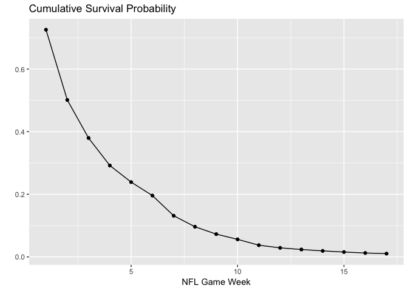

NFL Survival Pool Project
================
Jason Goldrosen
September 05, 2019

Background
----------

There's a big NFL survival pool taking at work this year. Distracted by the NBA, Premier League, and all things Michigan sports, I haven't followed the NFL that closely over the last few years. In order to set my picks on auto-pilot, I'm an going to implement an Linear Integer Programming solution to maximize the probabilities of surviving throughout the season.

Previewing and cleaning the data
--------------------------------

``` r
library(lpSolve)
library(ggplot2)


df <- read.csv("nfl_games_2019.csv") 
df$game_id <- c(1:nrow(df))
head(df)
```

    ##         date season neutral playoff team1 team2     elo1     elo2
    ## 1 2019-09-05   2019       0       0   CHI    GB 1588.898 1455.131
    ## 2 2019-09-08   2019       0       0   PHI   WSH 1581.514 1441.022
    ## 3 2019-09-08   2019       0       0   JAX    KC 1455.249 1602.077
    ## 4 2019-09-08   2019       0       0   CAR   LAR 1519.379 1598.016
    ## 5 2019-09-08   2019       0       0   MIA   BAL 1415.179 1570.539
    ## 6 2019-09-08   2019       0       0   MIN   ATL 1538.424 1520.316
    ##   elo_prob1 score1 score2 result1 game_id
    ## 1 0.7584485     NA     NA      NA       1
    ## 2 0.7654699     NA     NA      NA       2
    ## 3 0.3843697     NA     NA      NA       3
    ## 4 0.4803850     NA     NA      NA       4
    ## 5 0.3728156     NA     NA      NA       5
    ## 6 0.6173721     NA     NA      NA       6

``` r
df.1 <- df[,c(1,2,5,9,13)]
df.2 <- df[,c(1,2,6,9,13)]

names(df.1)[3:4] <- c("team","elo_prob")
names(df.2)[3:4] <- c("team","elo_prob")

df.2$elo_prob <- 1 - df.2$elo_prob
df.long <- rbind(df.1,df.2)
df.long <- df.long[order(df.long$game_id),]


df.long$date <- as.Date(df.long$date) 
df.long$dofw <- as.POSIXlt(df.long$date)$wday
df.long$date.2 <- df.long$date + (df.long$dofw == 4)*3 + (df.long$dofw == 1)*(-1) + (df.long$dofw == 6) + 1 
df.long$week <- as.integer((df.long$date.2-as.Date('2019-09-02'))/7)
```

Implementing lpSolve
--------------------

You can also embed plots, for example:

``` r
const <- matrix(rep(0,25088), 
                nrow=49, 
                ncol=512)
i <- 1
for (t in unique(df.long$team)){
const[i,] <- df.long$team == t
i <- i + 1
}

for (t in unique(df.long$week)){
  const[i,] <- df.long$week == t
  i <- i + 1
}
obj <- df.long$elo_prob
direction <- c(rep("<=",length(unique(df.long$team))),rep("=",length(unique(df.long$week))))
rhs <- rep(1,nrow(const))

test <- lp(direction = "max", 
           objective.in = obj, 
           const.mat = const, 
           const.dir = direction, 
           const.rhs = rhs)

solns <- df.long[test$solution!=0,c("week","team","elo_prob")]
#colnames(solns) <- c("Week", "Team", "Pr(Win)")

knitr::kable(solns, row.names=FALSE, digits = 4)
```

|  week| team |  elo\_prob|
|-----:|:-----|----------:|
|     1| DAL  |     0.7256|
|     2| CAR  |     0.6908|
|     3| MIN  |     0.7576|
|     4| PIT  |     0.7687|
|     5| PHI  |     0.8184|
|     6| NE   |     0.8198|
|     7| NYG  |     0.6712|
|     8| HOU  |     0.7324|
|     9| LAC  |     0.7551|
|    10| IND  |     0.7710|
|    11| WSH  |     0.6675|
|    12| CHI  |     0.7713|
|    13| KC   |     0.8185|
|    14| NO   |     0.8112|
|    15| BAL  |     0.8088|
|    16| SEA  |     0.8053|
|    17| LAR  |     0.8331|

``` r
solns$prob <- cumprod(solns$elo_prob)

ggplot(solns, aes(x=week,y=prob)) + 
  geom_point() + 
  geom_line() + 
  labs(title="Cumulative Survival Probability",x ="NFL Game Week", y = "")
```


